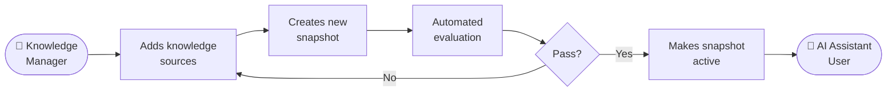

# Use Case: Automated Quality Testing for RAG Knowledge Bases

## The problem

RAG systems are not static. Knowledge bases are updated over time as policy changes, new guidance is published, or source documents are revised. Each update introduces risk: new content can contradict what the knowledge base already contains, remove information that was previously correct, or quietly degrade the quality of answers the system returns to users.

The current alternative — manual spot-checks before activating a new knowledge base version — does not scale. It is slow, cannot be comprehensive, and provides no way to compare quality over time or catch regressions consistently.

## The approach

This use case demonstrates how a RAG knowledge base can be tested automatically before a change goes live, using an LLM to judge whether the system is still producing correct answers.

Before a new version of the knowledge base is activated, a curated set of questions — each with a known correct answer — is run through the system. An LLM acts as the evaluator: it reads the system's response alongside the known correct answer and scores how well one reflects the other. Because the comparison is semantic rather than an exact string match, it can correctly identify answers that are equivalent even when they are worded differently.

A few terms worth knowing:

- **Evaluation dataset** — the curated set of questions and known correct answers (ground truths) that form the test suite. This is prepared in advance and reused across runs.
- **Ground truth** — the expected correct answer for a given question; not a verbatim string to match, but the substance of what a correct response should contain.
- **Rubric** — the scoring instructions given to the LLM judge, defining what "correct" means for a given type of question.
- **Knowledge snapshot** — an immutable, point-in-time version of the knowledge base. Evaluation always runs against a snapshot rather than the live state, so results are reproducible and comparable over time.
- **LLM-as-a-judge** — the approach of using a language model to evaluate semantic quality, rather than checking for an exact word match.

## What this is not

This is a quality gate, not a guarantee. The system catches regressions in the questions it has been given to test. It cannot detect issues in areas the evaluation dataset does not cover, which is why curating a representative dataset matters as much as the tooling itself. It also does not replace human judgement for significant knowledge base changes — it removes the bottleneck for routine updates.

## What you need to use it

- A knowledge base already powering a RAG service
- A curated evaluation dataset — questions representative of real user queries, each with a ground truth answer. This is the most important investment: the quality of the evaluation is bounded by the quality of this dataset.
- A rubric: agreed scoring criteria for what makes an answer correct in the context of your service
- Someone to maintain the dataset as the knowledge base evolves over time

## Tech patterns used

This use case is built on the following technical patterns:

- **[LLM-as-a-Judge Evaluation](https://github.com/DEFRA/ai-tech-pattern-llm-as-a-judge)** — automated evaluation design, judge configuration, async pipeline, multi-model comparison, and dataset design

## Reference implementation

The technical reference implementation — including architecture diagrams, service design, and setup instructions — is in the `reference/` folder. See [reference/README.md](reference/README.md) to get started, or [reference/docs/overview.md](reference/docs/overview.md) for the architecture overview.
