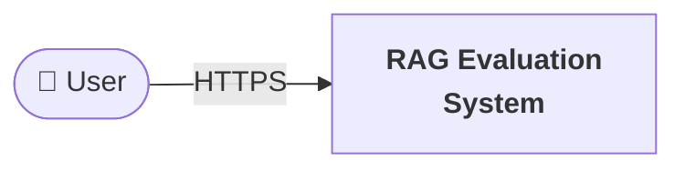
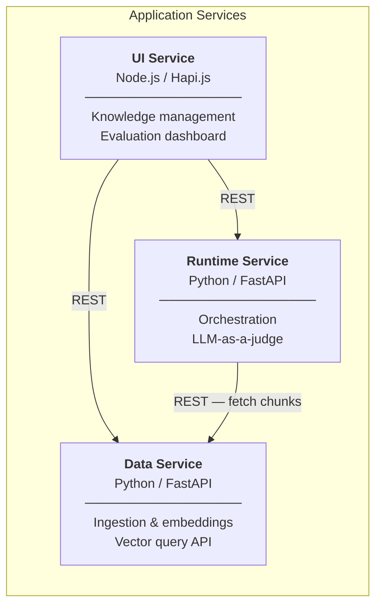
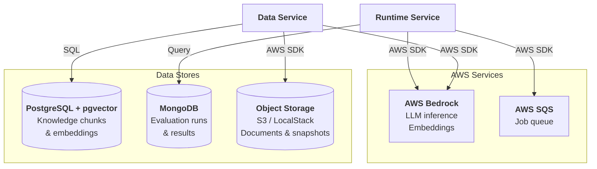

# RAG Evaluation System - Reference Implementation

This directory contains the Docker Compose orchestration and scripts for running a complete RAG (Retrieval-Augmented Generation) evaluation system locally. The system uses LLM-as-a-judge evaluation to systematically assess the quality of retrieval-augmented generation pipelines.

## Architecture Overview

The RAG evaluation system consists of three microservices:

1. **Data Service** - Knowledge ingestion, embedding generation, and vector storage
2. **Runtime Service** - Evaluation orchestration with LLM-based judging and SQS queue processing
3. **UI Service** - Web dashboard for knowledge management and evaluation workflows

### System Context



### Service Communication



### Data & External Integrations



## Prerequisites

- Docker
- Docker Compose
- Amazon Bedrock credentials and access to create inference profiles and guardrails
- uv - [Installation Guide](https://docs.astral.sh/uv/getting-started/installation/#installing-uv)
- Python 3.13 or higher - We recommend using uv to manage your Python environment
- Node.js 24 or higher - Required for the UI service
- Git
- AWS credentials with permissions for Bedrock, SQS, and S3

## Repositories

| Service | Description | Type | Language |
|---------|-------------|------|----------|
| [ai-uc-rag-evaluation-data](https://github.com/DEFRA/ai-uc-rag-evaluation-data) | Knowledge ingestion, embedding, vector storage | Backend API | Python |
| [ai-uc-rag-evaluation-runtime](https://github.com/DEFRA/ai-uc-rag-evaluation-runtime) | Evaluation orchestration, LLM judge, queue processing | Backend API | Python |
| [ai-uc-rag-evaluation-ui](https://github.com/DEFRA/ai-uc-rag-evaluation-ui) | Web dashboard for system management | Frontend | JavaScript |

## Local Development

### Prerequisites Check

Before proceeding, verify your environment is set up:

```bash
docker --version
docker-compose --version
python3 --version  # Should be 3.13 or higher
node --version     # Should be 24 or higher
uv --version
```

### Getting Started

Clone this repository and sync the environment:

```bash
git clone https://github.com/DEFRA/ai-uc-rag-evaluation
cd ai-uc-rag-evaluation
uv sync --frozen
```

### Cloning Service Repositories

This project includes a script that automatically clones all required service repositories into the `repos/` directory by checking the service composition definitions:

```bash
uv run task clone
```

Your service repositories will be located in the `repos/` directory.

### Environment Configuration

This repository uses a `.env` file for environment variable configuration. This must be created for the Docker Compose project to start.

> [!IMPORTANT]
> The `.env` file should not be committed to version control. Add it to your `.gitignore` file to keep sensitive configuration data secure.

Copy the example environment file to create your own:

```bash
cp .env.example .env
```

### Starting the Services

A single docker-compose project has been created that orchestrates all microservices, dependencies, and performs any necessary setup tasks such as database migrations.

All configuration is stored in the `.env` file. Before starting the services, ensure that the `.env` file is correctly configured. The services will use default values if no `.env` file is present.

To start all services, run the following command:

```bash
docker-compose up --build
```

To stop the services, run the following command:

```bash
docker-compose down
```

The services can still be started individually directly from their respective repositories. However, this project is intended to streamline local development by having a common entry point for all services.

## Network

All services run on a shared Docker network named `ai-uc-content-swarm` to enable inter-service communication.

## Script Documentation

This project contains a number of scripts to streamline local microservice development.

### Clone

Clones the repositories for each microservice into the parent directory.

```bash
uv run task clone
```

### Pull

Pulls the latest remote changes for each microservice.

```bash
uv run task pull
```

### Update

Switches to and pulls the latest main branch for each microservice.

```bash
uv run task update
```
