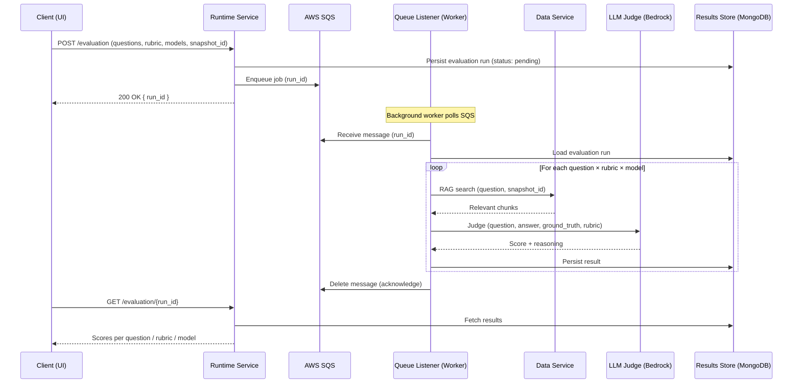

# Evaluation Flow

This document describes how a single evaluation run works end-to-end — from submission through async processing to result retrieval. It covers the three-phase lifecycle, SQS queue design, deduplication, and multi-model execution.

See also: [Knowledge and Evaluation Data](knowledge-and-evaluation-data.md) for a breakdown of the data the system works with.

---

## Overview

Evaluation is designed to be asynchronous. Running a full evaluation suite — executing RAG searches and LLM judgements across multiple questions, rubrics, and models — can take minutes. A synchronous HTTP request would time out before completion. The system decouples submission from execution using SQS, and clients retrieve results by polling.

---

## The Three-Phase Evaluation Lifecycle

### Phase 1: Submit

The client sends a `POST /evaluation` request to the Runtime Service with the evaluation configuration: the set of questions and ground truths, the rubric(s) to use, the judge model(s) to evaluate with, and the knowledge snapshot to evaluate against.

The Runtime Service persists the evaluation run to MongoDB (status: `pending`), enqueues a message on SQS containing the `run_id`, and immediately returns `200 OK` with the `run_id`. The client does not wait for evaluation to complete.

### Phase 2: Async Processing

The queue listener is a background worker within the Runtime Service. It continuously polls SQS and processes messages as they arrive.

For each message, the worker loads the evaluation run from MongoDB, then iterates over every combination of question × rubric × model. For each combination it:

1. Calls the Data Service's RAG search API to retrieve the most relevant knowledge chunks for the question (scoped to the specified snapshot)
2. Constructs the judge prompt using the question, RAG-retrieved answer, ground truth, and rubric
3. Calls the LLM judge via pydantic-ai's `LLMJudge` on Amazon Bedrock
4. Persists the score and reasoning to MongoDB

When all combinations are processed, the worker acknowledges the SQS message (deletes it from the queue), and the run status is updated to `complete`.

### Phase 3: Poll for Results

The client retrieves results by calling `GET /evaluation/{run_id}`. The Runtime Service fetches the run and all associated results from MongoDB and returns them — scores broken down by question, rubric, and model.

---

## Async Processing Detail

### SQS Queue Configuration

The queue is a FIFO queue, ensuring evaluations are processed in submission order. Key configuration:

| Setting | Value | Purpose |
|---|---|---|
| Visibility timeout | 30 seconds | Hides the message from other consumers while it is being processed |
| Max receive count | 3 | Number of times a message is retried before being moved to the DLQ |
| Dead Letter Queue (DLQ) | Enabled | Captures messages that fail after all retries for investigation |

### Retry Behaviour

If the worker crashes or fails mid-evaluation, the SQS visibility timeout expires and the message becomes visible again — it will be picked up and retried. However, partial results from the failed attempt may already be persisted to MongoDB. To prevent duplicate LLM calls on retry, the system uses deduplication.

---

## Deduplication

Each result is uniquely identified by the combination of `(run_id, question_id, rubric_id, model_id)`. Before calling the LLM judge for a given combination, the worker checks whether a result with that key already exists in MongoDB.

If a result exists (from a previous attempt), the worker skips that combination and moves on. This ensures that:
- Retried evaluations do not incur redundant LLM costs
- Results are not duplicated in MongoDB
- Partial progress from a failed attempt is preserved and built upon

---

## Multi-Model, Multi-Rubric Evaluation

The evaluation loop iterates over the Cartesian product of models × rubrics × questions. For an evaluation run configured with 3 models, 2 rubrics, and 10 questions, the system executes 60 individual judgements.

This design is intentional. Comparing scores across models for the same question and rubric reveals:
- Whether different judge models agree on quality
- Which models produce more consistent or discriminating scores
- Whether a rubric is well-calibrated (a poor rubric may cause all models to score similarly regardless of answer quality)

The results are stored and displayed at the level of individual question × rubric × model combinations, and can be aggregated to a run-level score.

---

## Bedrock Model Construction

The Runtime Service constructs Bedrock models using pydantic-ai with CDP-required configuration. Each judge model requires an inference profile ARN (specifying which model and region) and a guardrail (applied to all LLM requests as a safety control).

| Configuration | Purpose |
|---|---|
| `inference_profile_arn` | ARN specifying the Bedrock model and cross-region routing |
| `guardrail_id` + `guardrail_version` | AWS Bedrock guardrails — required by CDP for all LLM calls |

These are configured per-model via environment variables (see `reference/.env.example`). The same pattern applies whether the judge model is Claude 3 Haiku, Claude 3 Sonnet, or Claude 3.7 Sonnet.

---

## Service Data Access

| Store | Data Service | Runtime Service | UI Service |
|---|:---:|:---:|:---:|
| PostgreSQL + pgvector (knowledge chunks) | Read/Write | Read (via Data Service API) | — |
| AWS S3 (documents & snapshots) | Read/Write | — | — |
| MongoDB (evaluation runs & results) | — | Read/Write | Read (via Runtime Service API) |
| AWS SQS (job queue) | — | Read/Write | — |
