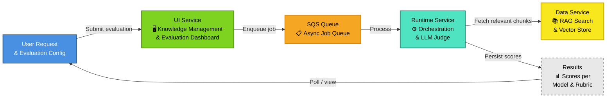

# ai-uc-rag-evaluation
This repository contains a reference implementation for the AICE RAG Evaluation reusable pattern.

## RAG Evaluation Overview

### The problem statement

Knowledge bases that power RAG (Retrieval-Augmented Generation) systems are not static — they are updated over time as policy, guidance, or source material changes. Each update carries risk: new content can contradict existing knowledge, introduce factual errors, or cause a previously correct RAG system to return wrong answers.

The example is straightforward: if a knowledge base correctly states that the capital of France is Paris, adding a document that incorrectly states it is London may cause a RAG system to return the wrong answer. Manual checks after ingestion cannot realistically catch every such conflict, especially at scale.

The current process looks like this:

```mermaid
flowchart LR
    KM["👤 Knowledge\nManager"]
    ADD["Add\nContent"]
    ING["Ingest &\nCreate Snapshot"]
    MANUAL["Manual\nVerification"]
    ACT["Activate\nSnapshot"]
    USER["👤 User"]

    KM -->|Upload document| ADD
    ADD --> ING
    ING --> MANUAL
    MANUAL -->|Approve| ACT
    ACT --> USER

    style KM fill:#4a90e2,stroke:#2e5c8a,stroke-width:2px,color:#fff
    style MANUAL fill:#e74c3c,stroke:#c0392b,stroke-width:2px,color:#fff
    style USER fill:#4a90e2,stroke:#2e5c8a,stroke-width:2px,color:#fff
    style ADD fill:#f5f5f5,stroke:#999,stroke-width:2px,color:#000
    style ING fill:#f5f5f5,stroke:#999,stroke-width:2px,color:#000
    style ACT fill:#f5f5f5,stroke:#999,stroke-width:2px,color:#000
```

This manual verification step is the critical bottleneck: it does not scale, it cannot be comprehensive, and it provides no automated regression capability — meaning there is no reliable way to catch regressions introduced by subsequent updates.

### Our approach

This implementation applies the **LLM-as-a-Judge** evaluation pattern to automate regression testing of knowledge base updates. Before a new snapshot is activated, a predetermined set of questions is run through the RAG system and the answers are scored against known ground truths by an LLM judge. This provides a repeatable, scalable quality gate that does not depend on manual review.

There are three key design decisions in this implementation:

**LLM-as-a-Judge over statistical metrics.** RAG responses are generative — the same correct answer can be phrased in many different ways. Statistical metrics such as exact match or BLEU score cannot capture semantic equivalence. Prior research spikes concluded that LLM-as-a-Judge is the most effective metric for evaluating generative AI responses against a known ground truth. Among the tools evaluated, [pydantic-ai](https://ai.pydantic.dev/)'s `LLMJudge` implementation performed best.

**Asynchronous evaluation via SQS.** Running a full evaluation suite — executing RAG searches and LLM judgements across multiple questions, rubrics, and models — is a long-running workload. A synchronous API would time out before completion. The system decouples submission from execution: an evaluation run is enqueued on SQS, processed asynchronously by a background worker, and results are retrieved by polling. This design prevents timeouts and allows multiple evaluations to run concurrently without blocking the UI.

**Multi-model, multi-rubric evaluation.** The quality of an LLM judgement depends on both the judge model and the rubric (the scoring prompt). By running each question across multiple model-rubric combinations, the system enables direct comparison of judgement quality — which is itself valuable evidence for selecting the right judge configuration for a given use case.

### The system design

#### Diagram

#### Service roles and responsibilities

The system is composed of three microservices, each with a distinct role:

| Service | Role | Tech |
|---|---|---|
| UI Service | Web dashboard — knowledge management, evaluation configuration, and results viewing | Node.js / Hapi.js |
| Data Service | Knowledge ingestion, embedding generation, vector storage, and RAG search API | Python / FastAPI |
| Runtime Service | Evaluation orchestration, SQS queue listener, and LLM-as-a-judge execution | Python / FastAPI |

The **UI Service** is the entry point for users. It provides the interface for uploading and managing knowledge sources, configuring evaluation datasets, submitting evaluation runs, and viewing results.

The **Data Service** manages the knowledge layer. It handles document ingestion and chunking, generates vector embeddings via Amazon Bedrock, stores them in PostgreSQL with pgvector, and exposes a RAG search API consumed by the Runtime Service during evaluation.

The **Runtime Service** is the evaluation engine. It receives evaluation requests via REST, enqueues jobs to SQS, and runs a background queue listener that executes the full evaluation loop: RAG search via the Data Service, followed by LLM-as-a-judge scoring across all configured model-rubric combinations. Results are persisted to MongoDB.

## Reference Implementation

The reference implementation is stored in the `reference/` folder, which contains the scripts, configurations, and Docker Compose setup needed to clone and run all the microservices. The actual service repositories are pulled from GitHub during setup using the provided scripts.

### Directory Structure

The key folders within `reference/` are:

- **`repos/`** — Location where the microservice repositories are cloned during setup:
  - `ai-uc-rag-evaluation-data/` — Data Service (Python): knowledge ingestion, embeddings, vector storage, and RAG search API
  - `ai-uc-rag-evaluation-runtime/` — Runtime Service (Python): evaluation orchestration, LLM-as-a-judge, and SQS queue processing
  - `ai-uc-rag-evaluation-ui/` — UI Service (JavaScript): web dashboard for knowledge management and evaluation workflows
- **`service-compose/`** — Docker Compose service definitions for each microservice
- **`dependencies/`** — Supporting service configurations (CDP uploader, database migrator)
- **`localstack/`** — Docker-based local AWS services setup (S3, SQS) with initialisation scripts
- **`scripts/`** — Utilities for cloning, pulling, and updating service repositories
- **`compose.yaml`** — Orchestrates the complete stack using Docker Compose

For detailed setup and deployment instructions, see [README.md](../README.md).

### Tech Stack

- [Pydantic AI](https://ai.pydantic.dev/) — LLM-as-a-judge execution via `LLMJudge`, Bedrock model integration
- [Amazon Bedrock](https://aws.amazon.com/bedrock/) — LLM inference for evaluation and vector embedding generation
- [Anthropic Claude](https://www.anthropic.com/claude) — Primary judge model family
- [PostgreSQL + pgvector](https://github.com/pgvector/pgvector) — Vector storage for knowledge chunks and embeddings
- [MongoDB](https://www.mongodb.com/) — Evaluation run and result persistence
- [AWS SQS](https://aws.amazon.com/sqs/) — Async job queue for evaluation runs

### Model Configuration

| Component | Model | Rationale |
|---|---|---|
| Embedding | Amazon Titan Embed Text v2 | Efficient, cost-effective embedding generation for knowledge chunks |
| LLM Judge | Claude 3 Haiku | Fast, lower-cost judge — useful for high-volume evaluation sweeps |
| LLM Judge | Claude 3 Sonnet | Balanced quality and cost for standard evaluation runs |
| LLM Judge | Claude 3.7 Sonnet | Higher-quality judge for validating rubrics and benchmarking |
| LLM Judge | GPT-OSS 120B | Large open-source model for cross-vendor judgement comparison |
| LLM Judge | GPT-OSS 20B | Smaller open-source model for cost-efficient cross-vendor comparison |

The system supports multiple judge models simultaneously. Running the same evaluation across different models allows teams to compare judgement consistency and identify which model-rubric combination produces the most reliable scores for their use case.

## Evaluation Deep-Dive

For detailed breakdowns of the evaluation flow, async processing design, and data model, see:

- [docs/evaluation-flow.md](docs/evaluation-flow.md) — End-to-end evaluation lifecycle, async SQS processing, deduplication, and multi-model execution
- [docs/knowledge-and-evaluation-data.md](docs/knowledge-and-evaluation-data.md) — Breakdown of knowledge snapshots, evaluation datasets, and results storage

## Further Information

This pattern was developed following two initial research spikes that evaluated different approaches to LLM validation and evaluation metrics:

- [ai-spike-llm-validation](https://github.com/DEFRA/ai-spike-llm-validation) — Investigated approaches to validating LLM-generated responses, establishing LLM-as-a-judge as the most effective metric
- [ai-spike-evaluation-metrics](https://github.com/DEFRA/ai-spike-evaluation-metrics) — Evaluated specific tooling and frameworks, identifying pydantic-ai's `LLMJudge` as the best-performing implementation

For the broader technical pattern documentation, including the rubric design guidance and evaluation methodology:

- [ai-tech-pattern-llm-as-a-judge](https://github.com/DEFRA/ai-tech-pattern-llm-as-a-judge) — The reusable pattern this reference implementation proves out
